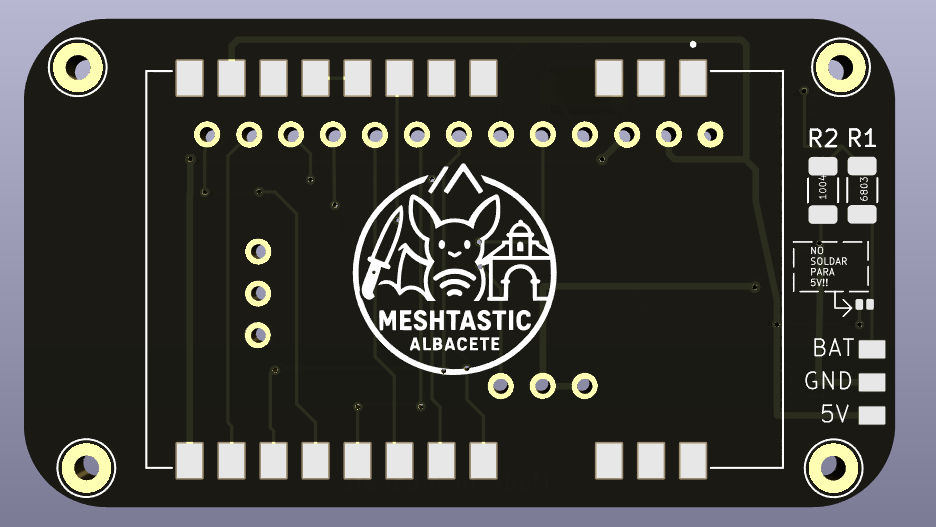
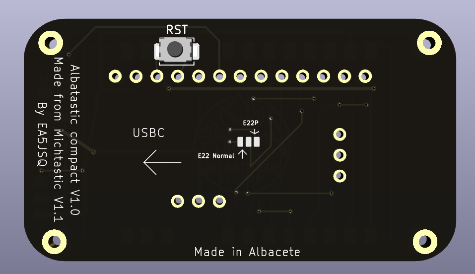

## PCB compacta para E22/E22P con NRF52840

Placa sencilla para montar un E22/E22P con un NRF52, con resistencias para monitorear el voltaje

V1.0 hecho a partir de la V1.1 de la Michtastic (https://github.com/Hamspiced/MichTastic_Node/tree/main)

---

### 🛠️ Método de montaje

1. **Suelda el E22/E22P y la resistencias SMD**  
   - Se puede soldar tanto con soldador, placa caliente o aire caliente. **Ojo a la hora de posicionar el E22/E22P**

2. **Suelda el selector de E22/E22P según tu placa**
   - Un punto de estaño rápido con el soldador es suficiente

4. **Suelda los espadines**  
   - Corta 1 espadín de la tira larga y alinealos con los agujeros (con el último de ellos, puedes ver que el primer agujero es un poco más pequeño y no entrará facilmente). Coloca la otra tira de 3 espadines en los otros agujeros, de manera que el lado largo de estos espadines sea el que está introducido en la PCB. Ahora pon el promicro encima y **solo suelda los espadines a la PCB del albatastic, no al promicro**. Quita el promicro y quita los separadores de plástico de los espadines.

5. **Suelda el promicro**  
   - Empuja el promicro hacia abajo y sueldalo. Corta los espadines sobrantes al acabar

6. **Suelda la alimentación**  
   - Se puede alimentar tanto a voltaje de batería (aunque el E22/E22P no sacará 1w), como a 5v. Tanto el voltaje de batería o los 5V irán a **5V**, tierra a **GND** y si quieres monitorear la batería, el positivo de la batería a **BAT** (si lo vas a alimentar con voltaje de batería hay un pequeño jumper que puedes soldar para monitorear la batería)

7. **Conecta la antena**  
   - Antes de encender el nodo, conecta la antena, para no dañar el módulo de radio

8. **Enciende el nodo y verifica el funcionamiento**
---

### Ejemplos de uso
Esta PCB se ha utilizado en el nodo de "Molatower", localizado en la cima del Molatón, Higueruela, Albacete, montado por nuestro compañero @ivansanchezfue4

Con este nodo se han podido unir las provincias de Murcia, Alicante y Valencia con Albacete. Si tienes más fotos de la PCB en uso, no dudes en mandármelas

---

### 🚧 Work in progress 🚧
Actualmente estoy trabajando en la versión V1.1, donde incluyo conexiones para el GPS, además de un hat/shield donde colocar un MPPT, booster y cargador USB-C. 

Hay soporte para el HT-RA62 y mosfet para el GPS. Los archivos serán publicados cuando se termine de probar la placa

---

### 📝 Licencia

Proyecto Open Source **No comercial**

---
